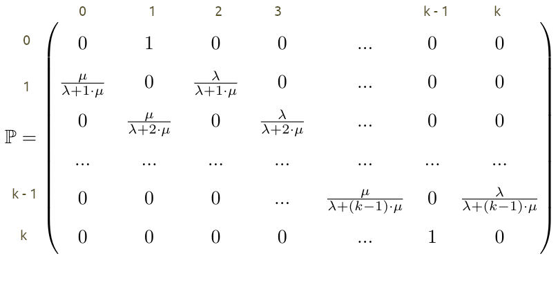
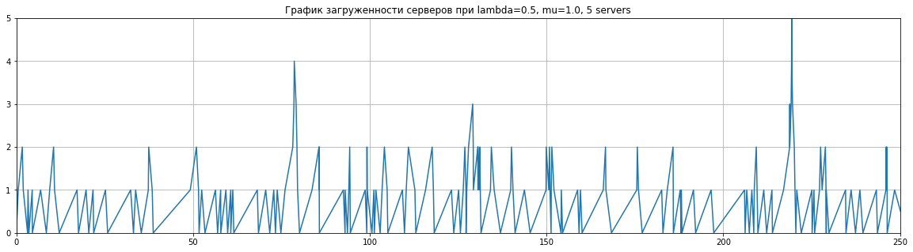
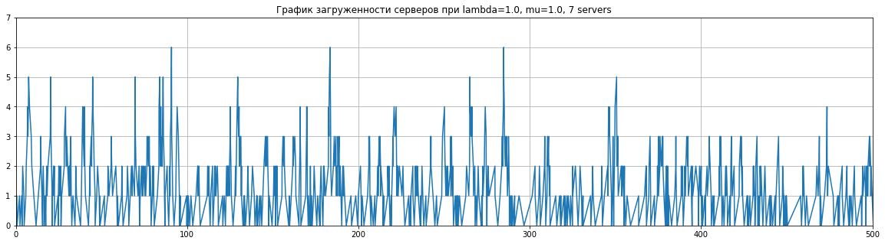
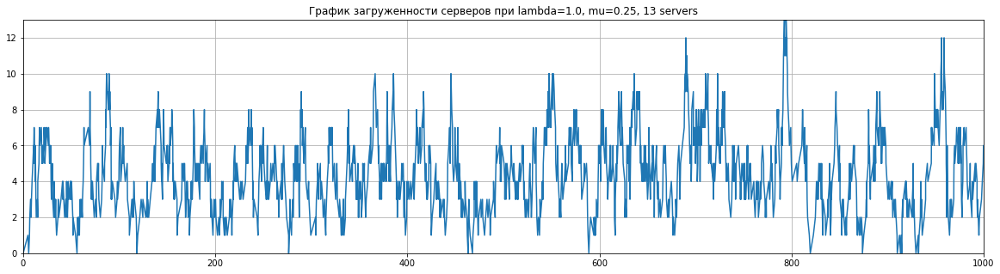
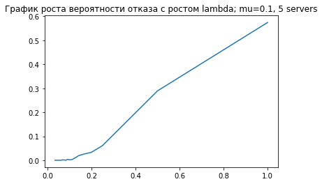
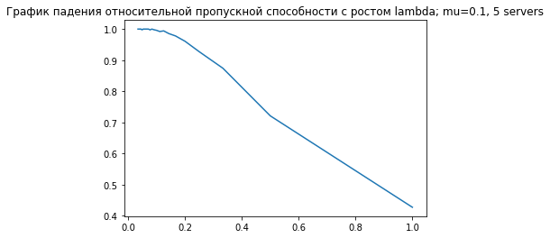
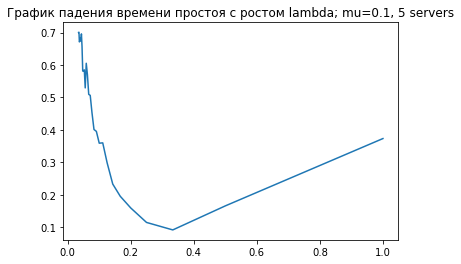
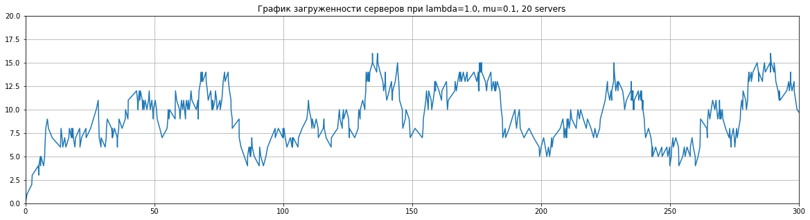
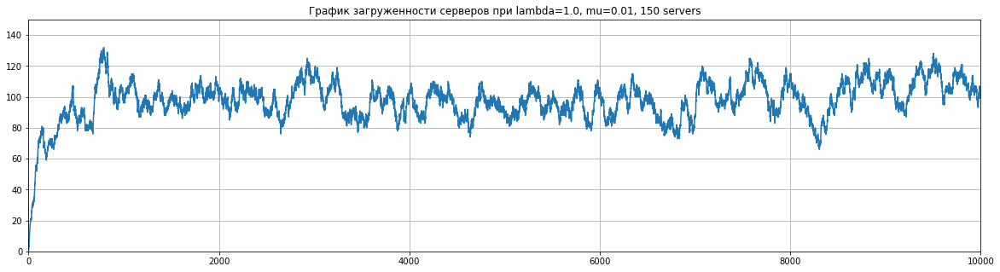

<h2>Математическая модель $M/M/k/0$</h2><br>
$\lambda$ - интенсивность входного потока,<br>
$\mu$ - интенсивность обслуживания<br><br>
$k$ - число серверов,<br>
$0$ - размер очереди,<br>

Модель без очереди, если пришедшее требование застает все сервера занятыми, то требование получает отказ в обслуживании и считается потерянным

<strong>Вероятностное пространство</strong> <br><br> $(\Omega,\mathcal{F},\mathcal{P(\bullet)})$, <i>где<br><br>
$ \mathcal{F=2^{\Omega}}$ 
      
$ \Omega = \{ \omega = (\omega_1, \omega_2, \omega_3,...) \} $, где <i> $  \omega_i \in \{0, 1, 2,\cdots,k \} $  - состояние системы (количество требований в системе) $\quad\quad\quad\quad\quad\quad\quad\quad\quad\quad\quad\quad\quad\quad\quad\quad \quad\quad \quad \quad$ в i-тый момент изменения системы <br><br><br>
 
$ P(\omega_{i+1} = \xi_{i+1} | \omega_{i} = \xi_{i}, \omega_{i-1} = \xi_{i-1}, ... , \omega_{1} = \xi_{1}) =  P(\omega_{i+1} = \xi_{i+1} | \omega_{i} = \xi_{i})$  $\;$ -  свойство марковсти <br><br>

$P_0(1, 0, 0, ...) $ <br>    
$ S = \{ 1, ..., k\} $ <br>
<br><br>
Пусть   $ X \sim exp(\lambda)$,  $ Y \sim exp(\mu) $<br><br>
Тогда   $ P(X<Y) = \int_{0}^{\infty}P(X < Y | Y = y) \cdot k \mu e^{-yk\mu } dy \;\; (\; = \;) \;\;$<br><br>

<center>$ P(X < Y | Y = y) = P(X < y | Y = y)$ = <br><br>
<center>= $ 1 - e^{-y \lambda} \Rightarrow P(x < y) =  \int_{0}^{\infty}(1 - e^{-y \lambda}) k\mu \cdot e^{-y k\mu} = $ <br><br>
<center>= $ \int_{0}^{\infty} k\mu e^{-yk \mu} dy - \mu k\int_{0}^{\infty} e^{-y (\lambda + k\mu)} dy = $ <br><br>
<center>$-e^{-y k\mu} |_0^{\infty} - \frac{k\mu}{\lambda + k\mu} \cdot e^{-y ( \lambda + k\mu) } |_0^{\infty} = \frac{ \lambda }{\lambda + k\mu}$ <br><br> 
<center>(т. к $\;\; -e^{-y k\mu} |_0^{\infty} \; = \;1$ и $\;\; e^{-y (\lambda + k\mu) } |_0^{\infty} \;=\; 1) $<br><br>

$P(X<Y) = \frac{\lambda}{\lambda + k \mu}$



(1) <br><br>
$ \lambda p_0 = \mu p_1 $ <br><br>
$ (\lambda + \mu) p_1 = 2  \mu p_2 + \lambda p_0 $ <br><br>
$ (\lambda + 2 \mu) p_2 = 3 \mu p_3 + \lambda p_1 $ <br><br>
$ ... $ <br><br>
$ (\lambda + i \mu) p_i = (i+1) \mu p_i + \lambda p_{i-1} $ <br><br>
$ k \lambda p_k = \lambda p_{k-1}$ <br><br>

Откуда
$ \lambda p_0 = \mu p_1 $ <br><br>
$ \lambda p_1 = 2 \mu p_2 $ <br><br>
$ \lambda p_2 = 3 \mu p_3 $ <br><br>
$ ... $ <br><br>
$ \lambda p_{k-1} = k \mu p_k $ <br><br>

Откуда: <br><br> 
(2)<br><br>
$ p_1 = \frac{\lambda}{\mu}p_0, \; p_2 = \frac{\lambda}{2 \mu} p_1 = \frac{1}{2} \frac{\lambda}{\mu}^2 p_0 \; ... $<br><br>
$ p_n = \frac{\lambda}{k \mu}p_{k-1} = \frac{1}{k!}\frac{\lambda}{\mu}^{k}p_0 $<br><br>
$ p_0 + p_1 + p_2 + ... + p_k = 1 $ <br><br>
$\Rightarrow $<br><br>
$ p_0( 1 + \frac{\lambda}{\mu} + ... \frac{\lambda^k}{k! \mu^k }) = 1 \Rightarrow p_0 = (1 + \frac{\lambda}{\mu} + ... + \frac{\lambda^k}{k! \mu^k})^-1$<br><br>

(1) и (2) - формулы финальных вероятностей (формулы Эрланга)

$ \frac{\lambda}{\mu} = \rho $ - среднее число заявок / среднее время обслуживания одной заявки <dr><dr>
$p_0 = (1 + \rho + \frac{\rho^2}{2!} + ... + \frac{\rho^k}{k!})^{-1}$ (1) <dr><dr>
$p_1 = \rho p_0,\; p_2 = \frac{\rho^2}{2!}p_0, \; ..., \; p_k = \frac{\rho^k}{k!}p_0 $ (2)<dr><dr>

Финальные вероятности:
$ \lambda \neq \mu: \;$ <br><br>

<center>$ p_0 = (1 + \rho + \frac{\rho^2}{2!} + ... + \frac{\rho^k}{k!} )^{-1}$ <br><br>
<center>$ p_1 = \rho p_0, \; p_2 = \frac{\rho^2}{2!}p_0, ..., \; p_k = \frac{\rho^k}{k!}p_0$<br><br>
    
$ \lambda = \mu: \;$ <br><br>

<center>$ p_0 = (1 + 1 + \frac{1}{2!} + ... + \frac{1}{k!} )^{-1} = (\sum_{i=0}^{k}\frac{1}{i!})^{-1}$ <br><br>
<center>$ p_1 = p_0, \; p_2 = \frac{p_0}{2}, ..., \; p_k = \frac{p_0}{k!}$ <br><br>

<center>
1) Среднее время обслуживания требования сервером = <br><br>
<center> $ \frac{1}{\mu}$ <br><br> 
2) Вероятность отказа $p_{\text{отк}}$ =<br><br>
    <center> $$ p_k = \frac{\rho^k}{k!}p_0 $$ <br><br>
3) Среднее число занятных серверов ($ k_{ср}$)<br><br>
<center> можно найтие как матожидание: <br><br>
<center>$k_{ср}$ = $E(0 \cdot p_0 + 1 \cdot p_1 + ... + k \cdot p_k)$ <br><br>
<center>или через абсолютную пропускную способность $A$: <br><br>
<center>$k_{ср} = \frac{A}{\mu} = \rho ( 1 - \frac{\rho^k}{k!}p_0)$ <br><br>
4) Абсолютная пропускная способность A (среднее число заявок, обслуживаемых в единицу времени) <br><br>
<center>$A = \lambda \cdot Q = \lambda( 1 - \frac{\rho^k}{k!}p_0) $ <br><br>
5) Отностительная пропускная способность $Q$ (вероятность принятие в обслуживание) <br><br>
<center>$Q = 1 - p_{\text{отк}} = 1 - \frac{\rho^k}{k!}p_0 $ <br><br>
6) Вероятность простоя системы: $p_n = p_0 $ <br><br>

## 2. Реализация модели


```python
import numpy as np
import matplotlib.pyplot as plt
import math
```


```python
def simulate(mean_arrival_rate, mean_departure_rate, number_of_servers, end_time):
    timeline = []
    active_servers = 0
    current_time = np.random.exponential(mean_arrival_rate)
    while current_time <= end_time:
        timeline.append({'event': 'arrival', 'served': None, 'time': current_time, 'active_servers': 0, 'time_in_state': 0})
        current_time += np.random.exponential(mean_arrival_rate)
    current_time = 0
    for point in timeline:
        current_time = point['time']
        if point['event'] == 'arrival':
            if active_servers < number_of_servers:
                point['served'] = True
                active_servers+=1
                point['active_servers'] = active_servers
                departure_point = {'event': 'departure', 'time': current_time+np.random.exponential(mean_departure_rate), 'time_in_state': 0}
                for i in range(len(timeline)-1, -1, -1):
                    if timeline[i]['time'] < departure_point['time']:
                        timeline.insert(i+1, departure_point)
                        break
            else:
                point['served'] = False
        elif point['event'] == 'departure':
            active_servers-=1
            point['active_servers'] = active_servers
    for i in range(len(timeline)-1):
        timeline[i]['time_in_state'] = timeline[i+1]['time'] - timeline[i]['time'] 
    return timeline
```


```python
def stationary_probabilities(timeline, num_servers):
    states_time = [0 for i in range(num_servers+1)]
    for event in timeline:
        states_time[event['active_servers']]+=event['time_in_state']
    return [states_time[i]/res[-1]['time'] for i in range(len(states_time))]
```


```python
def reject_probability(timeline):
    arrivals = [event for event in timeline if event['event']=='arrival']
    rejected = [arrival for arrival in arrivals if arrival['served']==False]
    return len(rejected)/len(arrivals)
```


```python
def relative_bandwith(timeline):
    return 1 - reject_probability(timeline)
```


```python
def absolute_bandwith(timeline):
    arrivals = [event for event in timeline if event['event']=='arrival']
    served = [arrival for arrival in arrivals if arrival['served']==True]
    return len(served)/timeline[-1]['time']
```


```python
def average_load(timeline, mu_):
    return absolute_bandwith(timeline)/mu_
```


```python
def downtime_probability(timeline):
    no_clients = [event for event in timeline if event['active_servers']==0]
    downtime = sum([event['time_in_state'] for event in no_clients])
    return downtime/timeline[-1]['time']
```


```python
def draw_load_plot(arrival_rate, departure_rate, servers, end_time=250):
    timeline = simulate(arrival_rate, departure_rate, servers, end_time)
    plt.figure(figsize=(20,5))
    plt.grid()
    plt.axis([0, end_time, 0, servers])
    plt.title(label="График загруженности серверов при lambda={}, mu={}, {} servers".format(np.round(1/arrival_rate, 2), np.round(1/departure_rate, 2), servers))
    ax = [point['time'] for point in timeline]
    ax.insert(0, 0)
    ay = [point['active_servers'] for point in timeline]
    ay.insert(0, 0)
    plt.plot(ax, ay)
    plt.show()
```


```python
def draw_rejection_plot(mean_departure_rate, servers):
    mean_arrival_rate = list(range(1,30))
    lambda_ = [1/x for x in mean_arrival_rate]
    rejection_probabilities = []
    for x in mean_arrival_rate:
        res = simulate(x, mean_departure_rate, servers, 10000)
        rejection_probabilities.append(reject_probability(res))
    plt.title(label='График роста вероятности отказа с ростом lambda; mu={}, {} servers'.format(1/mean_departure_rate, servers))
    plt.plot(lambda_, rejection_probabilities)
    plt.show()
```


```python
def draw_rel_bandwith_plot(mean_departure_rate, servers):
    mean_arrival_rate = list(range(1,30))
    lambda_ = [1/x for x in mean_arrival_rate]
    rel_bandwiths = []
    for x in mean_arrival_rate:
        res = simulate(x, mean_departure_rate, servers, 10000)
        rel_bandwiths.append(relative_bandwith(res))
    plt.title(label='График падения относительной пропускной способности с ростом lambda; mu={}, {} servers'.format(1/mean_departure_rate, servers))
    plt.plot(lambda_, rel_bandwiths)
    plt.show()
```


```python
def draw_downtime_plot(mean_departure_rate, servers):
    mean_arrival_rate = list(range(1,30))
    lambda_ = [1/x for x in mean_arrival_rate]
    downtime = []
    for x in mean_arrival_rate:
        res = simulate(x, mean_departure_rate, servers, 10000)
        downtime.append(downtime_probability(res))
    plt.title(label='График среднего времени простоя с ростом lambda; mu={}, {} servers'.format(1/mean_departure_rate, servers))
    plt.plot(lambda_, downtime)
    plt.show()
```

## 3. Эксперимент

### 1. $\lambda<\mu$


```python
draw_load_plot(2, 1, 5)
```





### 2. $\lambda=\mu$


```python
draw_load_plot(1, 1, 7, 500)
```





### 3. $\lambda>\mu$


```python
draw_load_plot(1, 4, 13, 1000)
```





#### Видно, что если при росте $\lambda$ относительно $\mu$ нам требуется больше серверов для песперебойной работы.
#### Посмотрим на графики зависимости некоторых статистик модели от роста $\lambda$

### Вероятность отказа


```python
draw_rejection_plot(10, 5)
```





### Относительная пропускная способность


```python
draw_rel_bandwith_plot(10, 5)
```





#### На этих двух графиках видно, как с ростом $\lambda$ пяти серверов становится недостаточно, и приходится отказывать заявкам.

### Время простоя системы


```python
draw_downtime_plot(10, 5)
```





### Проведем эксперименты с очень большими $\lambda$ относительно $\mu$


```python
draw_load_plot(1, 10, 20, 300)
```





# ВЫШЕЛ КИБЕРПАНК 2077, ВСЕ ХОТЯТ ЕГО СКАЧАТЬ, МНОГО ЗАЯВОК!


```python
draw_load_plot(1, 100, 150, 10000)
```





### На наш взгляд, отличающей особенностью данной системы является то, что даже при большой нагрузке и долгом времени обработки систему можно сбалансировать при помощи достаточного количества серверов.
### Если бы мы решали некую бизнес задачу, то зная сколько примерно будет обрабатываться заявка, и спрогнозировав поток пользователей, можно подготовиться, поставить больше серверов и избежать потери денег от упущенных клиентов.

## 4. Проверка модели


```python
def Pi_n(lambda_, mu_, n):
    return pow(lambda_/mu_, n)/math.factorial(n)
```


```python
def Pi_0(lambda_, mu_, n):
    return 1/(sum([Pi_n(lambda_, mu_, i) for i in range(n+1)]))
```


```python
def theoretical_stationary_probabilities(lambda_, mu_, n):
    pi0 = Pi_0(lambda_, mu_, n)
    return [Pi_n(lambda_, mu_, i)*pi0 for i in range(n+1)]
```


```python
def theoretical_average_load(lambda_, mu_, n):
    probs = theoretical_stationary_probabilities(lambda_, mu_, n)
    return sum([server_number*probs[server_number] for server_number in range(len(probs))])
```


```python
def theoretical_reject_probability(lambda_, mu_, n):
    return pow((lambda_/mu_), n) / math.factorial(n) * Pi_0(lambda_, mu_, n)
```


```python
def theoretical_absolute_bandwith(lambda_, mu_, n):
    return lambda_*theoretical_relative_bandwith(lambda_, mu_, n)
```


```python
def theoretical_relative_bandwith(lambda_, mu_, n):
    return 1 - theoretical_reject_probability(lambda_, mu_, n)
```

#### Сравним экспериментально полученные статистики модели c вычисленными по теоретическим формулам.

### Стационарные вероятности
#### Теоретические:


```python
theoretical_stationary_probabilities(1, 1, 5)
```


    [0.3680981595092025,
     0.3680981595092025,
     0.18404907975460125,
     0.06134969325153375,
     0.015337423312883437,
     0.0030674846625766876]


#### Практические:


```python
res = simulate(1, 1, 5, 1000)
stationary_probabilities(res, 5)
```


    [0.38186385167175807,
     0.37123960415530505,
     0.17377990775547525,
     0.05149536571912897,
     0.017145006218107647,
     0.0031251705646565104]


```python
res = simulate(1, 1, 5, 10000)
stationary_probabilities(res, 5)
```


    [0.3628174160056652,
     0.3796408483513869,
     0.18326411803912182,
     0.058408526082050896,
     0.013642145384177597,
     0.0021590971551570456]


#### Видим, что вычисленные вероятности для состояний системы очень близки к теоретическим стационарным вероятностям для фиксированного K
#### Проверим еще несколько значений


```python
theoretical_stationary_probabilities(1/10, 1/3, 5)
```


    [0.7408188010921892,
     0.2222456403276568,
     0.03333684604914852,
     0.0033336846049148534,
     0.000250026345368614,
     1.5001580722116842e-05]


```python
res = simulate(10, 3, 5, 1000)
stationary_probabilities(res, 5)
```


    [0.7537123739225232,
     0.2019433859525935,
     0.03113149422303651,
     0.006245723472419933,
     0.0,
     0.0]


```python
res = simulate(10, 3, 5, 10000)
stationary_probabilities(res, 5)
```


    [0.7272683087900984,
     0.23328096861796882,
     0.03587112374397565,
     0.0032924708189850153,
     2.6912830856784126e-05,
     0.0]


#### С ростом числа шагов вычисленные вероятности приближаются к теоритическим.


```python
theoretical_stationary_probabilities(1, 1/2, 5)
```


    [0.13761467889908258,
     0.27522935779816515,
     0.27522935779816515,
     0.1834862385321101,
     0.09174311926605505,
     0.03669724770642202]


```python
res = simulate(1, 2, 5, 1000)
stationary_probabilities(res, 5)
```


    [0.1717422492737713,
     0.2816295883340158,
     0.27667477588701944,
     0.17148692123286652,
     0.07384071952570047,
     0.024509088206684442]


```python
res = simulate(1, 2, 5, 10000)
stationary_probabilities(res, 5)
```


    [0.15579040673518188,
     0.28068774320734985,
     0.2741267454674457,
     0.17731608813100588,
     0.08831587610189033,
     0.02363894756496464]


#### Чуть хуже, но все же похоже.

### Проверим также и другие характеристики.


```python
res = simulate(2, 3, 5, 10000)
```


```python
print(reject_probability(res))
print(theoretical_reject_probability(1/2, 1/3, 5))
```

    0.011897435897435898
    0.014183155314305725
    


```python
print(relative_bandwith(res))
print(theoretical_relative_bandwith(1/2, 1/3, 5))
```

    0.9881025641025641
    0.9858168446856943
    


```python
print(absolute_bandwith(res))
print(theoretical_absolute_bandwith(1/2, 1/3, 5))
```

    0.4815971831182091
    0.49290842234284715
    


```python
print(average_load(res, 1/3))
print(theoretical_average_load(1/2, 1/3, 5))
```

    1.4447915493546273
    1.4787252670285413
    


```python
print(downtime_probability(res))
print(Pi_0(1/2, 1/3, 5))
```

    0.2287133380814342
    0.22412887410260898
    

#### Как видим, характеристики тоже были посчитаны довольно точно.
